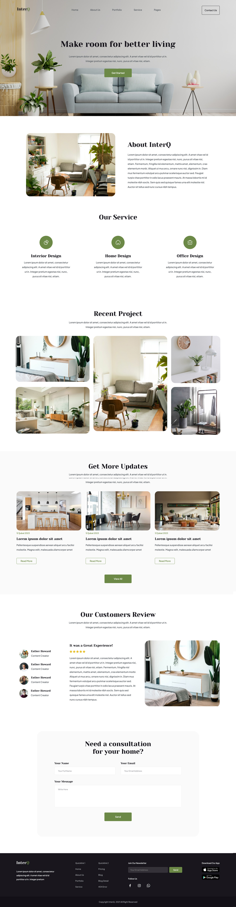
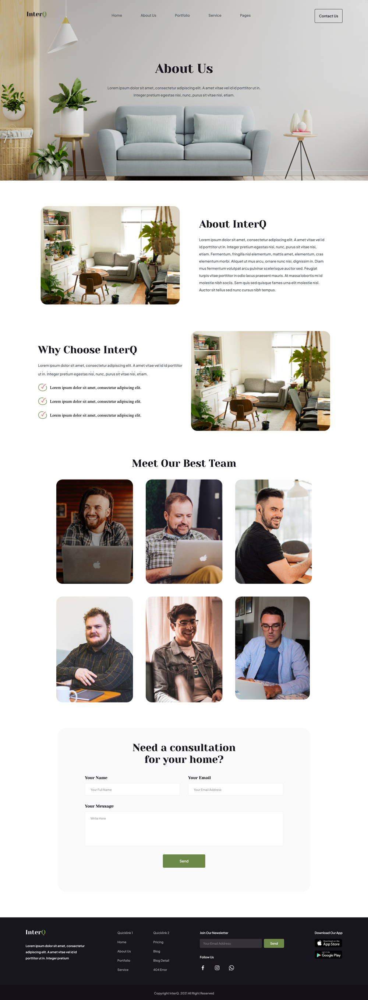
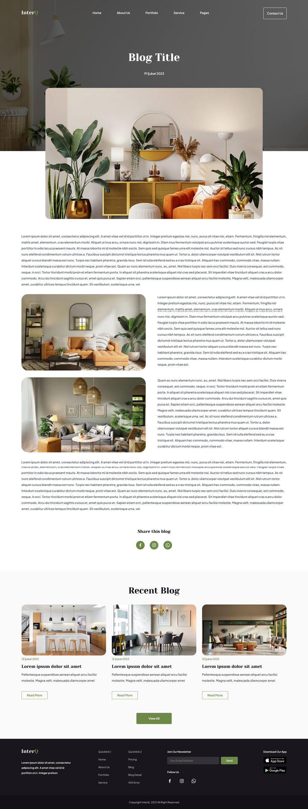

# Premium Interior Web Template

Bu proje, modern ve minimalist bir tasarım anlayışıyla geliştirilmiş premium iç mekan web şablonunu içerir.

## Kullanılan Teknolojiler

- HTML
- CSS
- JavaScript

## Kurulum ve Başlatma

1. Repoyu bilgisayarına klonla.
2. `index.html` dosyasını tarayıcında aç.

## Özellikler

- Anasayfa
- Hakkımızda Sayfası
- Portfolyo Sayfası
- Servis Sayfası
- İletişim Formu
- Blog Sayfası
- Blog Detay Sayfası
- Hata  Sayfası
- Ödeme Sayfası
- İletişim Sayfası

## Ekran Görüntüleri

### Anasayfa

### Hakkımızda

### Blog Detay

